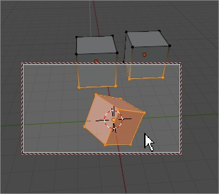

# cam_view_select_geo

issue: for the moment this is selecting in cam field, but even ones hidden behind

A script to select vertices of selected objects under cam view

In any mode, on selected objects, activate cam view and run the script from text editor:
vertices in cam field will be selected (and deselected outside)

