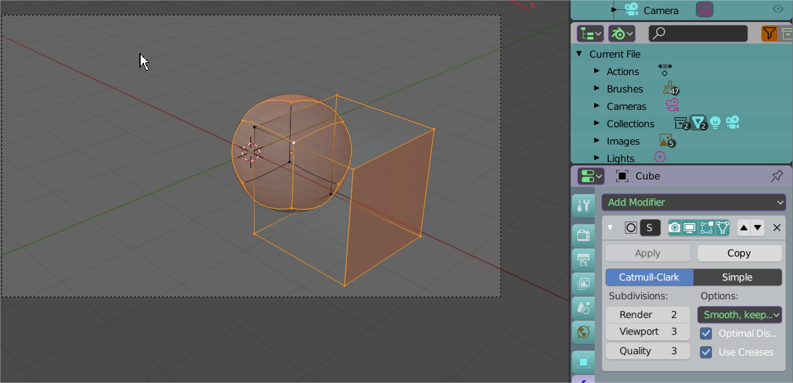

# cam_view_select_geo

A script to select vertices of selected objects under cam view
inspired from there (last publi) https://blender.stackexchange.com/questions/882/how-to-find-image-coordinates-of-the-rendered-vertex
on selected objects, go to cam view. 
run it as an operator from the searchbar with his lable: simple object operator   

 

